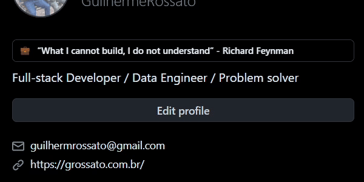

# Snackbar Alert

Shows an informative and temporary status message popup on a web page.

```ts
function showSnackbarAlert(
  message: string | Error,
  variant: "info" | "success" | "warning" | "error",
  ms?: number = 6000
)
```



## Usage

```
showSnackbarAlert("Informative variant (default)");
showSnackbarAlert("Successfull variant", "success");
showSnackbarAlert("Warning variant", "warning");
showSnackbarAlert("Error variant", "error");
showSnackbarAlert(new Error("Error variant (forced)"), "ignored");
```

They are useful to display status of operations, for example:

```js
  fetch('/api/user').then((r) => r.json()).then(
    (user) => showSnackbarAlert(`User ${user.name} loaded`)
  ).catch(
    (err) => showSnackbarAlert(err)
  );
```


This script depends on native frontend javascript features, does not need external libraries, and the HTML elements added are independent of the page styles.
